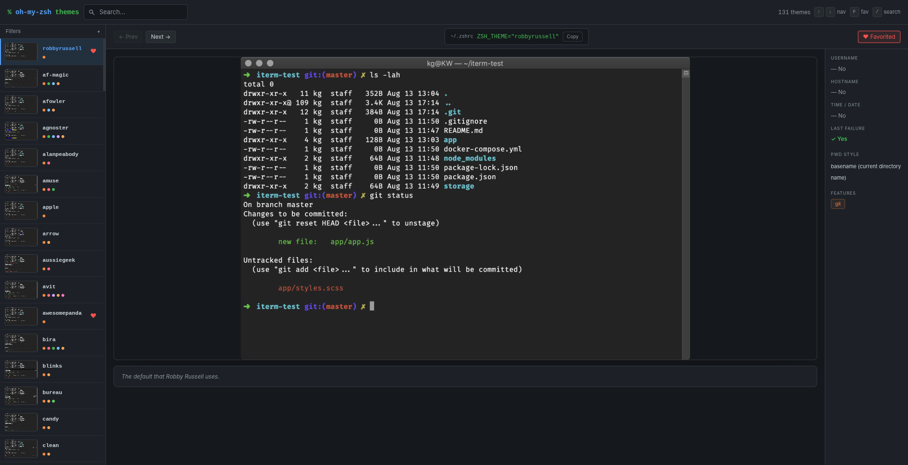

# Oh My Zsh Theme Explorer

**Browse, filter, and preview every [Oh My Zsh](https://ohmyz.sh) theme — live, in your browser.**



## Features

- **Filter by prompt features** — git, ruby, virtualenv, SSH indicator, vi-mode, battery, node.js, kubernetes, AWS, and more
- **Filter by prompt segments** — username, hostname, time/date, last-command failure indicator
- **Favorites** — bookmark themes with `F` and toggle favorites-only view
- **Keyboard navigation** — `↑`/`↓` or `j`/`k` to move, `/` to focus search
- **Live data** — theme list is fetched from the [ohmyzsh wiki](https://github.com/ohmyzsh/wiki) on every load

## Getting started

```bash
pnpm install
pnpm dev
```

Then open [http://localhost:5173](http://localhost:5173).

## Building

```bash
pnpm build       # outputs to dist/
pnpm preview     # preview the production build locally
```

## Stack

- [React 19](https://react.dev)
- [Vite 8](https://vite.dev)
- [Tailwind CSS v4](https://tailwindcss.com)
- TypeScript
